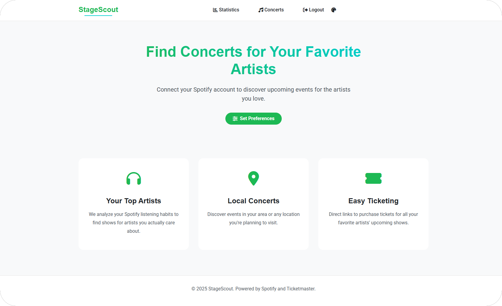
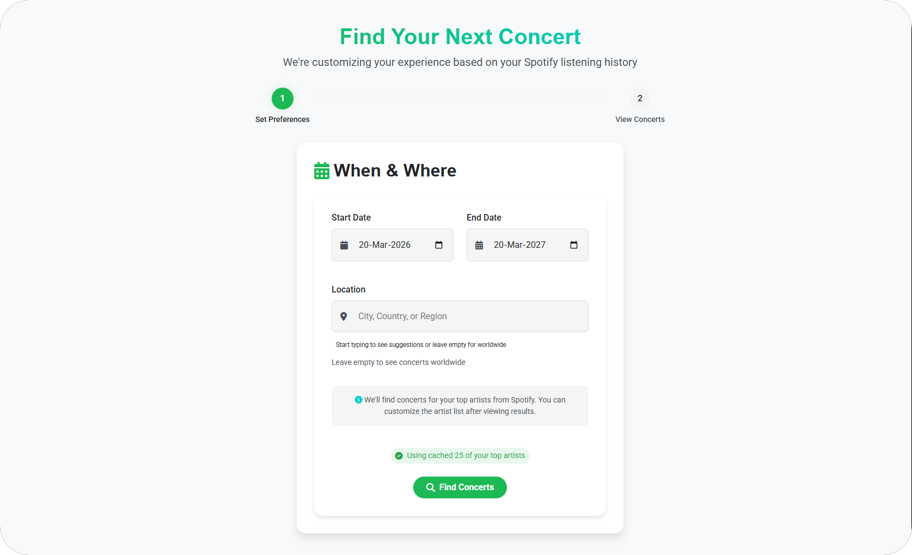
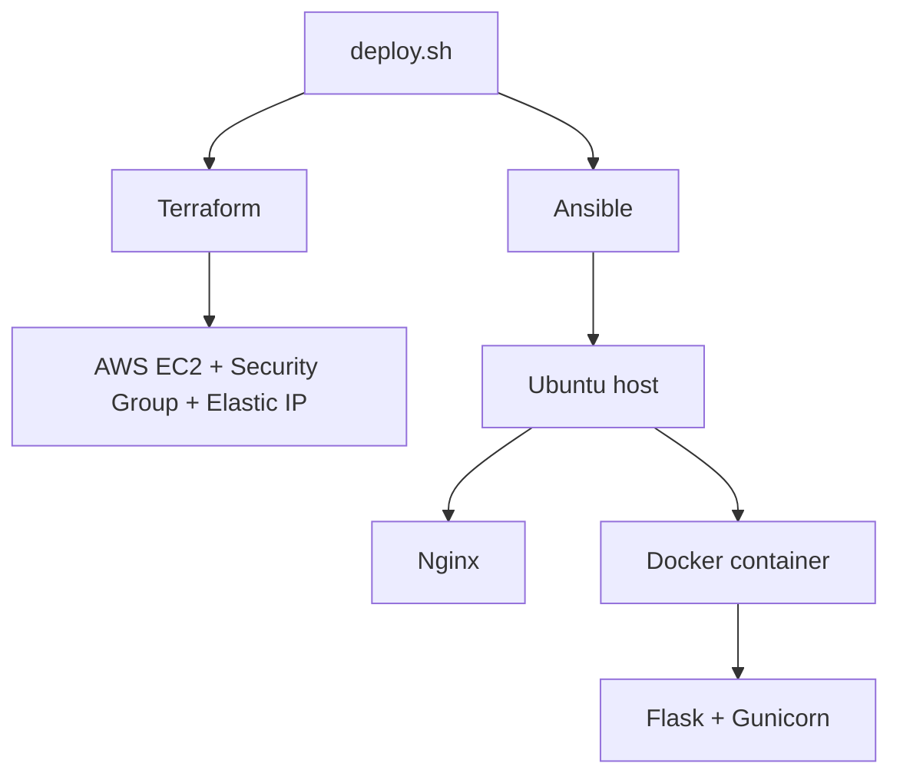

# StageScout

StageScout is a concert discovery app that turns a user's Spotify taste into live event recommendations.

This public repository is a product and architecture showcase for the live app at [stage-scout.fun](https://stage-scout.fun).

## What the app does

1. Connects to Spotify with OAuth.
2. Pulls a user's top artists and listening signals.
3. Lets the user pick a location and date range.
4. Finds matching concerts and presents them in a focused dashboard.

## Stack

| Area | Tools | Notes |
| --- | --- | --- |
| Backend | Flask, Gunicorn | App factory pattern with blueprint-based routing |
| Frontend | HTML, CSS, Vanilla JavaScript | Lightweight UI with multi-theme support |
| Data sources | Spotify, Ticketmaster, Geoapify | Identity, music taste, event search, location autocomplete |
| State | Flask-Session, filesystem cache | Server-side sessions and cached API results |
| Infra | AWS EC2, Docker, Nginx | Single-host production deployment |
| Automation | Terraform, Ansible | Provisioning, server bootstrap, deploy flow |
| Observability | Prometheus, Grafana, Node Exporter | App and host metrics |

## Product walkthrough

| Landing | Preferences |
| --- | --- |
|  |  |

## Architecture

## Deployment model

## License

MIT. See [LICENSE](LICENSE).
