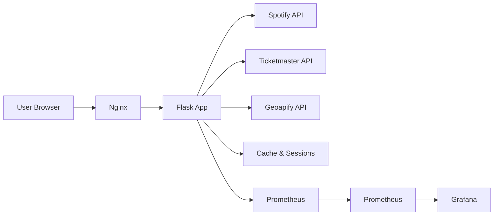
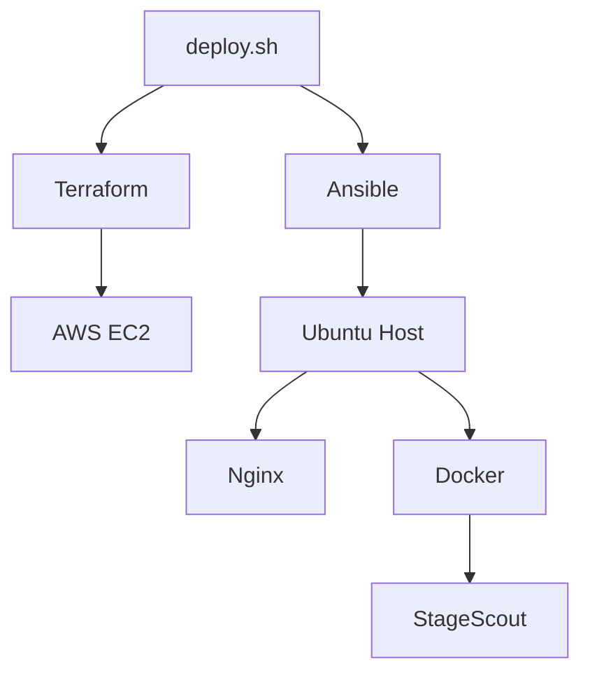

# StageScout

<p align="center">
  
</p>

<p align="center">
  <strong>Discover concerts for the artists you actually listen to.</strong>
</p>

<p align="center">
  <a href="https://stage-scout.fun">Live App</a>
  •
  <a href="docs/application-architecture.md">Architecture</a>
  •
  <a href="docs/infrastructure.md">Infrastructure</a>
  •
  <a href="docs/repository-scope.md">Repo Scope</a>
</p>

---

StageScout transforms your Spotify listening history into personalized concert recommendations. Connect your account, pick your location and dates, and discover live shows from your favorite artists.

## Features

### For Users
- **Spotify-Powered Discovery** — Pull your top artists directly from Spotify for truly personalized recommendations
- **Location & Date Filtering** — Search for concerts within a specific radius and date range
- **Progressive Loading** — See location-based matches instantly while artist-specific events load in the background
- **Clean Dashboard** — Focused view of upcoming concerts with all the essential details

### For Developers
- **Blueprint-Based Architecture** — Clean separation of concerns with modular Flask blueprints
- **Server-Side Sessions** — Secure session management with hardened cookie settings
- **Multi-API Integration** — Unified interface for Spotify, Ticketmaster, and Geoapify
- **Production-Ready** — Full IaC pipeline with Terraform, Ansible, Docker, and Nginx

## Tech Stack

<p align="center">

| Category | Stack |
|----------|-------|
| **Backend** | Flask, Gunicorn |
| **Frontend** | HTML, CSS, Vanilla JS |
| **APIs** | Spotify, Ticketmaster, Geoapify |
| **State** | Flask-Session, Filesystem Cache |
| **Infrastructure** | AWS EC2, Docker, Nginx |
| **Automation** | Terraform, Ansible |
| **Monitoring** | Prometheus, Grafana |

</p>

## How It Works

```
┌─────────────┐    ┌─────────────┐    ┌─────────────┐    ┌─────────────┐
│   Spotify   │───▶│   Select    │───▶│  Location   │───▶│  Concert    │
│   Login     │    │   Artists   │    │  & Dates    │    │  Results    │
└─────────────┘    └─────────────┘    └─────────────┘    └─────────────┘
```

1. **Connect** — Authenticate via Spotify OAuth
2. **Select** — Review your top artists and confirm your favorites
3. **Search** — Choose your location and preferred date range
4. **Discover** — View upcoming concerts from your selected artists

## Screenshots

| Landing Page | Preferences |
|:------------:|:-----------:|
|  |  |

## System Architecture

### Application Flow


### Deployment Pipeline


## Documentation

- [Application Architecture](docs/application-architecture.md) — Routes, data flow, security model
- [Infrastructure](docs/infrastructure.md) — AWS setup, deployment, monitoring
- [Repository Scope](docs/repository-scope.md) — What's public vs. private

## Public Repo Scope

**Included:**
- Product overview and feature documentation
- Architecture diagrams and flowcharts
- Public-safe screenshots
- High-level stack and operations notes

**Excluded:**
- Application source code
- Terraform and Ansible configurations
- Secrets, credentials, and environment variables
- Production deployment details

## License

MIT License — see [LICENSE](LICENSE) for details.

---

<p align="center">
  Built with Flask • Powered by Spotify
</p>
