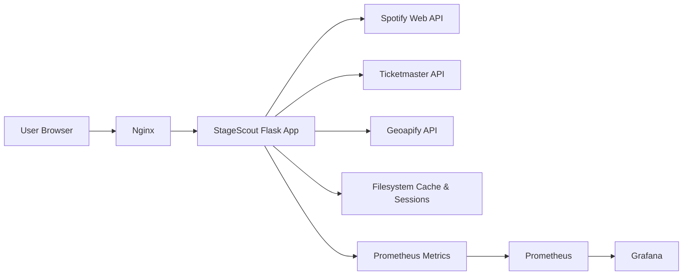
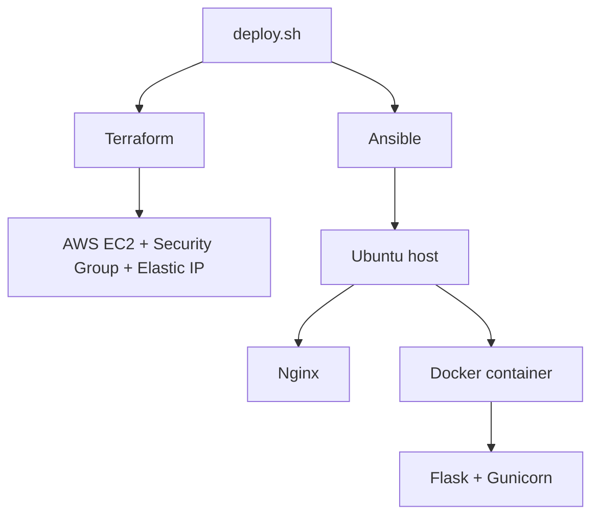

# StageScout

> Concert discovery powered by your Spotify taste.

StageScout connects to a user's Spotify account, analyzes their listening history, and surfaces live concerts near them — filtered by artist taste, location, and date range.

---

## Screenshots

**Landing**

**Preferences**

---

## How it works

1. User authenticates via **Spotify OAuth**
2. App pulls their **top artists and listening signals**
3. User selects a **location and date range**
4. Matching concerts are fetched and displayed in a focused dashboard

---

## Stack

| Area | Tools | Notes |
|---|---|---|
| Backend | Flask, Gunicorn | App factory pattern, blueprint-based routing |
| Frontend | HTML, CSS, Vanilla JS | Lightweight UI with multi-theme support |
| Data sources | Spotify, Ticketmaster, Geoapify | Music taste, event search, location autocomplete |
| State | Flask-Session, filesystem cache | Server-side sessions and cached API results |
| Infra | AWS EC2, Docker, Nginx | Single-host production deployment |
| Automation | Terraform, Ansible | Provisioning, bootstrap, and deploy flow |
| Observability | Prometheus, Grafana, Node Exporter | App and host metrics |

---

## Architecture

---

## Deployment

Full deployment docs in [`docs/`](docs/).

---

## License

MIT — see [LICENSE](LICENSE).
