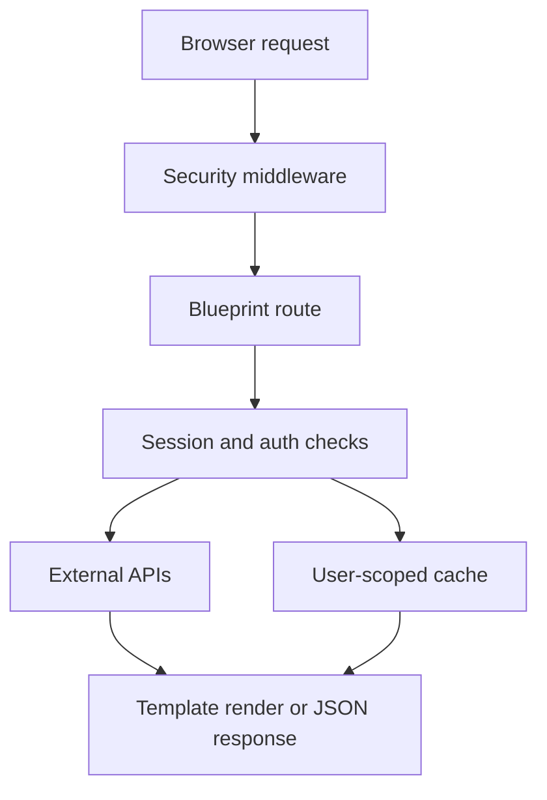

# Application Architecture

## Overview

StageScout is a Flask application that combines Spotify identity and listening data with Ticketmaster event discovery and Geoapify location search. The runtime is structured around a small set of focused blueprints and a server-rendered UI enhanced with lightweight JavaScript.

## Main flow

1. The user lands on the marketing page and starts Spotify login.
2. Spotify OAuth establishes a server-side session.
3. The app loads top artists and lets the user confirm preferences.
4. The results page performs a location-first event search.
5. Remaining artist-specific event searches continue in the background and stream into the dashboard.

## Server structure

- Application factory bootstraps config, proxy handling, sessions, cache, middleware, and blueprints.
- Blueprints split the product into auth, landing pages, preferences, artists, events, and statistics.
- Service modules handle Spotify auth and API access.
- Utility modules manage caching, session safety, rate limiting, and parallel event fetches.

## Route surface

| Area | Purpose |
| --- | --- |
| `/login`, `/callback`, `/logout` | Spotify OAuth lifecycle |
| `/` | Landing page |
| `/select-preferences` | Date and location selection |
| `/select-artists`, `/search-artists`, `/fetch-top-artists` | Artist selection and enrichment |
| `/results`, `/fetch-events`, `/fetch_remaining_events` | Event discovery and progressive loading |
| `/statistics` | Listening insights |
| `/metrics` | Prometheus scraping target |

## Runtime design

## Security and session model

- Spotify login uses OAuth instead of local passwords.
- Sessions are stored server-side rather than in browser-local app state.
- Cookie settings are hardened for production with HTTPOnly and SameSite protections.
- Proxy-aware deployment uses `ProxyFix` so HTTPS and forwarded headers behave correctly behind Nginx.
- Middleware adds defensive response headers and validates protected-session flows.

## Performance characteristics

- Cached artist and event data reduce repeated external API calls.
- Background fetching improves perceived speed on the results page.
- Event searches are parallelized while still respecting rate-limiting concerns.
- Server-rendered templates keep the client bundle small.

## Frontend approach

- Server-rendered HTML templates drive the main experience.
- Vanilla JavaScript handles theme switching, location autocomplete, event grouping, and progressive loading.
- CSS is organized into reusable component files and theme tokens instead of a frontend framework build step.

## Observability

- The app exposes request metrics through `/metrics`.
- Request counts and latency are intended for Prometheus collection.
- Production monitoring can be paired with Grafana and Node Exporter for host-level visibility.
